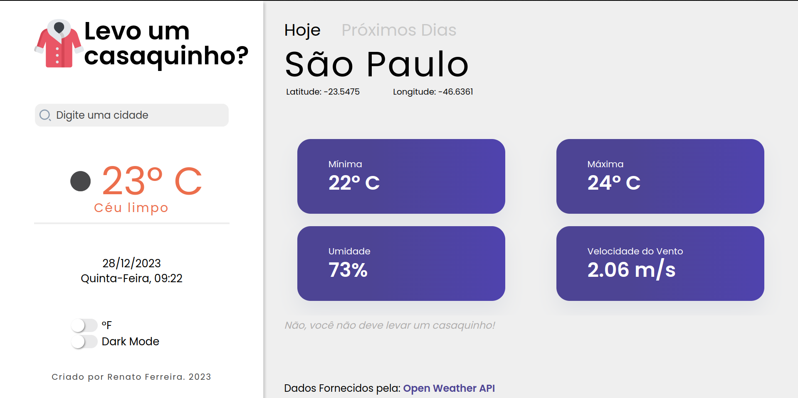
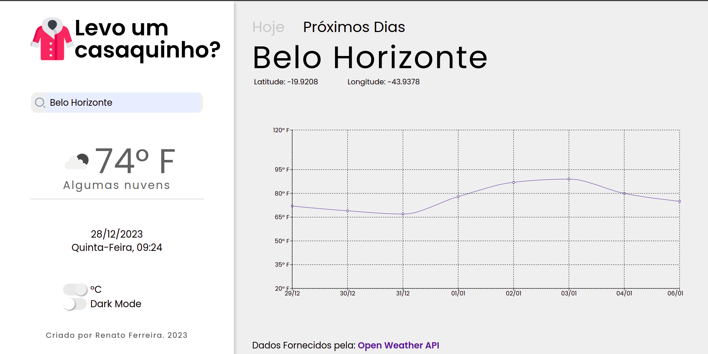
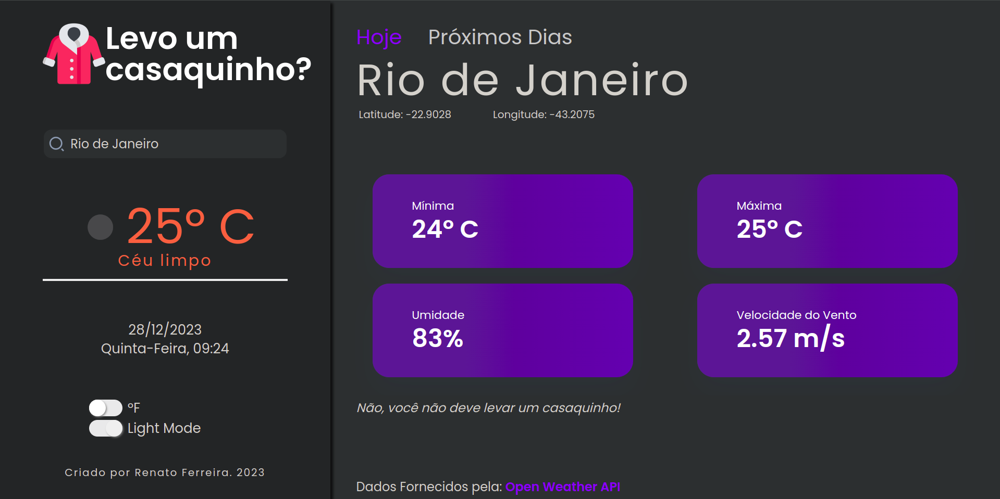
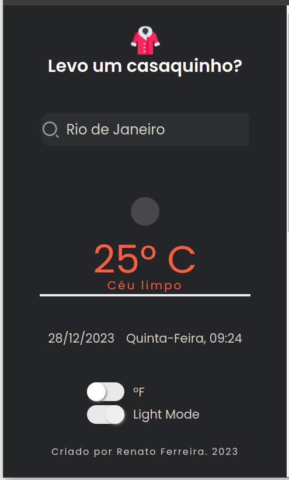

# Levo um Casaquinho?
Vai sair de casa? Vai passear? Viajar por alguns dias? Surgiu aquela dúvida de levar ou não levar um casaquinho?😫 Resolvi isso com esta aplicação em ReactJS + Vite, onde é possível descobrir a temperatura atual, mínima e máxima além de saber a umidade do ar e a velocidade do vento.

# Teste Aqui
[Deploy](https://levo-um-casaquinho-lemon.vercel.app/)

# Imagens da Aplicação





# Tecnologias
ReactJS
Vite (5.0.8)
[OpenWeather API](https://openweathermap.org/)
[Recharts](https://recharts.org/en-US/)

# Bibliotecas
* axios
* dayjs
* dotenv
* react
* react-dom
* react-icons
* react-router-dom
* recharts
* styled-components

# Como Rodar 
* Clone o repositório em sua máquina: ```git clone https://github.com/RenatoGFerreira/levo-um-casaquinho```.
* Dentro da pasta ```/levo-um-casaquinho``` Instale as dependências com o comando: ```npm i``` ou ```npm install```.
* Copie o arquivo ```.env.example``` e cole no mesmo diretório mudando o nome para ```.env```.
* Depois do cadastro no [OpenWeather](https://openweathermap.org/api), Insira a chave de acesso da api no local indicado dentro do arquivo ```.env```.
* Inicie a aplicação com o comando ```npm run dev```.

# Como Funciona 
* Insira o nome de uma cidade no campo de busca para obter as informações do local.
* Visualize a temperatura atual, máxima, mínima, velocidade do vento e umidade na guia **Hoje**.
* Confira o gráfico com a temperatura para os próximos dias na guia **Próximos Dias**.
* A aplicação abre sempre primeiramente com a cidade de São Paulo, mas você pode mudar trocando a cidade dentro do arquivo ```.env``` em ```VITE_CITY_BASE```.


